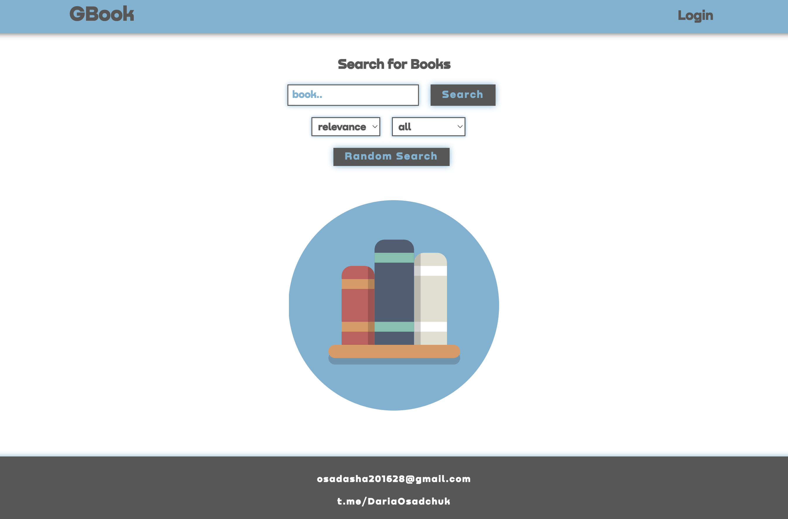

## Search Books App

#### Для запуска приложения на компьютере необходимо выполнить следующие действия:

1. Скачать Git-репозиторий ;
2. В корневой папке проекта создать файл с названием .env и заполнить его по примеру файла .env.example (Примечание: GOOGLE_API_KEY - это ваш api ключ к сервису Google Api Books);
3. Запустить приложение:
- Для Docker: В терминале в корневой папке проекта запустить команду make dc или docker-compose up --build --remove-orphans

- Локально: В терминале в корневой папке проекта запустить команду:

1.  make install или cd front && npm install

    Дождаться установки всех пакетов.

2.  make run_dev или cd front && npm run webpack-config-dev

